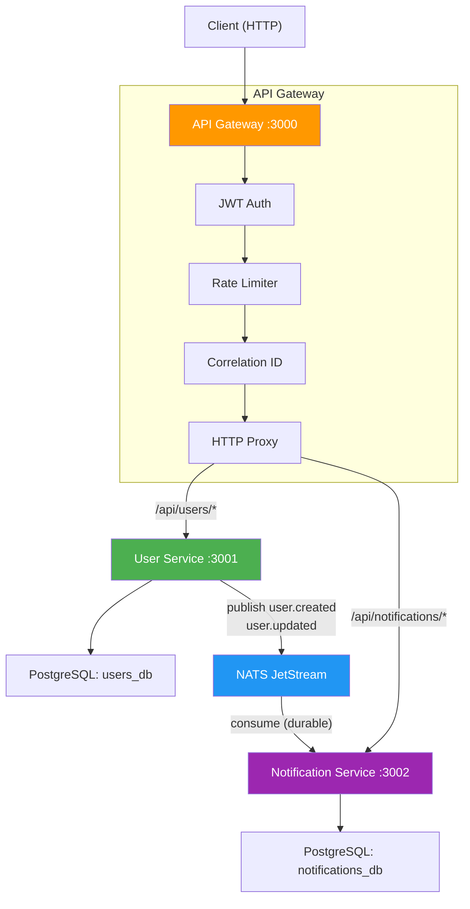

# Microservices Backend — TypeScript + NATS JetStream

A production-quality microservices backend with API Gateway, User Service, and Notification Service using NATS JetStream for asynchronous event-driven communication.

## Table of Contents

1. [Project Overview](#project-overview)
2. [Architecture](#architecture)
3. [Architecture Diagram](#architecture-diagram)
4. [Service Responsibilities](#service-responsibilities)
5. [Event Flow](#event-flow)
6. [NATS Design](#nats-design)
7. [Security Design](#security-design)
8. [Reliability & Failure Handling](#reliability--failure-handling)
9. [Database Design](#database-design)
10. [Environment Variables](#environment-variables)
11. [Local Setup](#local-setup)
12. [Docker Setup](#docker-setup)
13. [API Documentation](#api-documentation)
14. [Example Requests/Responses](#example-requestsresponses)
15. [Example Event Payloads](#example-event-payloads)
16. [Testing Instructions](#testing-instructions)
17. [Design Trade-offs](#design-trade-offs)
18. [Known Limitations](#known-limitations)

---

## Project Overview

This project implements a microservices architecture using:

- **Node.js + TypeScript** for all services
- **Express** for HTTP servers
- **NATS JetStream** for asynchronous event-driven messaging
- **PostgreSQL** for data persistence
- **JWT** for API authentication
- **Docker Compose** for orchestration
- **Zod** for runtime request validation
- **Pino** for structured logging

The key architectural principle: **User Service and Notification Service do NOT communicate via REST or WebSocket**. All inter-service communication flows through NATS JetStream events.

---

## Architecture

```
Client (HTTP)
    │
    ▼
┌─────────────────┐
│   API Gateway    │  Port 3000
│  (JWT, Rate Limit│
│   Proxy, Logging)│
└────────┬────────┘
         │
    ┌────┴────┐
    │         │
    ▼         ▼
┌────────┐ ┌────────────────┐
│ User   │ │ Notification   │
│Service │ │ Service        │
│:3001   │ │ :3002          │
└───┬────┘ └───┬────────────┘
    │          │
    │   ┌──────┘
    ▼   ▼
┌────────────┐
│ PostgreSQL │
│ (2 DBs)    │
└────────────┘

User Service ──publish──► NATS JetStream ──consume──► Notification Service
```

---

## Architecture Diagram



---

## Service Responsibilities

### API Gateway (`:3000`)
- JWT authentication for all protected routes
- Request rate limiting (configurable window/max)
- Correlation ID generation and propagation
- Request logging with duration tracking
- HTTP proxy to downstream services
- Centralized error handling
- Token generation endpoint (dev convenience)
- **No business logic**

### User Service (`:3001`)
- CRUD operations for users
- PostgreSQL persistence
- Input validation via Zod schemas
- Publishes `user.created` and `user.updated` events to NATS JetStream
- **Never calls Notification Service directly**

### Notification Service (`:3002`)
- NATS JetStream durable consumer
- Processes `user.created` and `user.updated` events
- Idempotent event processing (duplicate detection)
- Simulated notification sending
- Notification persistence and query
- Explicit message acknowledgement after processing
- Retry/redelivery handling with dead-letter termination

---

## Event Flow

```
1. Client sends POST /api/users to API Gateway
2. Gateway authenticates JWT, applies rate limit, generates correlation ID
3. Gateway proxies request to User Service
4. User Service validates input, creates user in PostgreSQL
5. User Service publishes user.created event to NATS JetStream
   - Event includes: eventId, eventType, timestamp, correlationId, user data
6. NATS JetStream stores the event in the USERS stream
7. Notification Service's durable consumer receives the event
8. Notification Service checks idempotency (has this eventId been processed?)
9. If not duplicate: creates notification record, marks event as processed
10. Notification Service explicitly acknowledges the message
11. If processing fails: message is NAKed for redelivery (up to 5 attempts)
```

---

## NATS Design

### Stream Configuration
| Setting | Value | Rationale |
|---|---|---|
| Stream Name | `USERS` | Groups all user-related events |
| Subjects | `user.>` (wildcard) | Captures `user.created`, `user.updated`, future events |
| Retention | Limits-based | Bounded storage with max messages/bytes/age |
| Max Messages | 100,000 | Prevents unbounded growth |
| Max Age | 7 days | Events older than a week are discarded |
| Max Bytes | 100 MB | Storage cap |
| Storage | File-based | Persists across NATS restarts |
| Duplicate Window | 2 minutes | Prevents publisher-side duplicates |

### Consumer Configuration
| Setting | Value | Rationale |
|---|---|---|
| Durable Name | `notification-service` | Survives consumer restarts |
| Ack Policy | Explicit | Only ack after successful processing |
| Ack Wait | 30 seconds | Allows time for DB operations |
| Max Deliver | 5 | Prevents infinite retry loops |
| Deliver Policy | All | Don't miss events on first connect |
| Filter Subjects | `user.created`, `user.updated` | Only process relevant events |

### Dead Letter Strategy
When a message reaches max deliveries (5), it is **terminated** (`msg.term()`). This removes the message from redelivery. A detailed error log is emitted with the event ID, subject, and delivery count for monitoring/alerting.

---

## Security Design

| Aspect | Implementation |
|---|---|
| API Authentication | JWT (HS256) verified at the API Gateway |
| Token Expiry | 24 hours |
| Public Endpoints | `/health`, `/auth/token` |
| NATS Authentication | Username/password in NATS server config |
| Secrets Management | Environment variables, never hardcoded |
| Input Validation | Zod schemas validate all request bodies and params |
| Error Responses | Internal errors return generic messages; no stack traces |
| Logging | Pino with redaction of `password`, `token`, `authorization`, `secret` |
| Rate Limiting | Configurable per-IP rate limit at the gateway |

### Credential Configuration for Local Development
1. Copy `.env.example` to `.env`
2. Modify values as needed (defaults are provided for development)
3. The `.env` file is gitignored

---

## Reliability & Failure Handling

### At-Least-Once Delivery
- NATS JetStream guarantees at-least-once delivery with explicit ack
- Messages are redelivered if not acknowledged within 30 seconds
- Up to 5 delivery attempts before termination

### Idempotent Processing
- The `processed_events` table tracks processed event IDs
- Before processing, the notification service checks if the event was already handled
- Duplicate events are silently skipped

### Graceful Shutdown
All services handle `SIGTERM` and `SIGINT`:
1. Stop accepting new connections
2. Drain NATS connections (finish in-flight messages)
3. Close database pools
4. Force exit after 10-second timeout

### Database Error Handling
- Connection pools with configurable size and timeouts
- Pool-level error listeners to catch unexpected disconnects
- Transactional event processing (notification + idempotency record)

### NATS Reconnection
- Infinite reconnect attempts (`maxReconnectAttempts: -1`)
- 2-second reconnect wait
- Connection status monitoring and logging

---

## Database Design

### Users Database (`users_db`)

```sql
CREATE TABLE users (
    id UUID PRIMARY KEY DEFAULT gen_random_uuid(),
    email VARCHAR(255) UNIQUE NOT NULL,
    name VARCHAR(255) NOT NULL,
    created_at TIMESTAMPTZ NOT NULL DEFAULT NOW(),
    updated_at TIMESTAMPTZ NOT NULL DEFAULT NOW()
);
CREATE INDEX idx_users_email ON users(email);
```

### Notifications Database (`notifications_db`)

```sql
CREATE TABLE processed_events (
    event_id UUID PRIMARY KEY,
    event_type VARCHAR(100) NOT NULL,
    processed_at TIMESTAMPTZ NOT NULL DEFAULT NOW()
);

CREATE TABLE notifications (
    id UUID PRIMARY KEY DEFAULT gen_random_uuid(),
    user_id UUID NOT NULL,
    event_id UUID NOT NULL,
    event_type VARCHAR(100) NOT NULL,
    channel VARCHAR(50) NOT NULL DEFAULT 'email',
    status VARCHAR(50) NOT NULL DEFAULT 'pending',
    content TEXT NOT NULL,
    error TEXT,
    retry_count INTEGER NOT NULL DEFAULT 0,
    created_at TIMESTAMPTZ NOT NULL DEFAULT NOW(),
    updated_at TIMESTAMPTZ NOT NULL DEFAULT NOW()
);
CREATE INDEX idx_notifications_user_id ON notifications(user_id);
CREATE INDEX idx_notifications_event_id ON notifications(event_id);
```

---

## Environment Variables

| Variable | Default | Description |
|---|---|---|
| `JWT_SECRET` | — | Secret key for JWT signing |
| `POSTGRES_USER` | `postgres` | PostgreSQL username |
| `POSTGRES_PASSWORD` | — | PostgreSQL password |
| `POSTGRES_HOST` | `postgres` | PostgreSQL host |
| `POSTGRES_PORT` | `5432` | PostgreSQL port |
| `USERS_DB_NAME` | `users_db` | Users database name |
| `NOTIFICATIONS_DB_NAME` | `notifications_db` | Notifications database name |
| `NATS_URL` | `nats://nats:4222` | NATS server URL |
| `NATS_USER` | — | NATS auth username |
| `NATS_PASSWORD` | — | NATS auth password |
| `API_GATEWAY_PORT` | `3000` | API Gateway port |
| `USER_SERVICE_PORT` | `3001` | User Service port |
| `NOTIFICATION_SERVICE_PORT` | `3002` | Notification Service port |
| `RATE_LIMIT_WINDOW_MS` | `60000` | Rate limit window in ms |
| `RATE_LIMIT_MAX_REQUESTS` | `100` | Max requests per window |
| `LOG_LEVEL` | `info` | Logging level |
| `NODE_ENV` | `development` | Environment mode |
| `SIMULATE_FAILURE_EVERY_N` | `0` | Simulate failure every Nth notification (0 = disabled) |

---

## Local Setup

### Prerequisites
- Node.js 20+
- Docker & Docker Compose

### Install Dependencies
```bash
npm install
```

### Build
```bash
npm run build
```

### Run Tests
```bash
npm test
```

---

## Docker Setup

### One-Command Startup
```bash
# Copy environment configuration
cp .env.example .env

# Start everything
docker compose up -d --build
```

### Verify All Services Are Healthy
```bash
docker compose ps
```

### View Logs
```bash
docker compose logs -f
```

### Stop Everything
```bash
docker compose down -v
```

---

## API Documentation

Full OpenAPI specification: [docs/openapi.yaml](docs/openapi.yaml)

### Endpoints

| Method | Path | Auth | Description |
|---|---|---|---|
| `POST` | `/auth/token` | No | Generate JWT token |
| `GET` | `/health` | No | Gateway health check |
| `POST` | `/api/users` | Yes | Create a user |
| `GET` | `/api/users` | Yes | List all users |
| `GET` | `/api/users/:id` | Yes | Get user by ID |
| `PUT` | `/api/users/:id` | Yes | Update user |
| `DELETE` | `/api/users/:id` | Yes | Delete user |
| `GET` | `/api/users/health` | No | User Service health |
| `GET` | `/api/notifications/:userId` | Yes | Get user notifications |
| `GET` | `/api/notifications/health` | No | Notification Service health |

---

## Example Requests/Responses

### 1. Generate Token
```bash
curl -X POST http://localhost:3000/auth/token \
  -H 'Content-Type: application/json' \
  -d '{"email": "test@example.com"}'
```
Response:
```json
{
  "token": "eyJhbGciOiJIUzI1NiIs...",
  "expiresIn": "24h",
  "tokenType": "Bearer"
}
```

### 2. Create User
```bash
curl -X POST http://localhost:3000/api/users \
  -H 'Authorization: Bearer <TOKEN>' \
  -H 'Content-Type: application/json' \
  -d '{"email": "john@example.com", "name": "John Doe"}'
```
Response (201):
```json
{
  "id": "550e8400-e29b-41d4-a716-446655440000",
  "email": "john@example.com",
  "name": "John Doe",
  "createdAt": "2024-01-01T00:00:00.000Z",
  "updatedAt": "2024-01-01T00:00:00.000Z"
}
```

### 3. Get Notifications
```bash
curl http://localhost:3000/api/notifications/550e8400-e29b-41d4-a716-446655440000 \
  -H 'Authorization: Bearer <TOKEN>'
```
Response:
```json
{
  "notifications": [
    {
      "id": "660e8400-...",
      "userId": "550e8400-...",
      "eventId": "770e8400-...",
      "eventType": "user.created",
      "channel": "email",
      "status": "sent",
      "content": "Welcome! Your account has been created successfully. Email: john@example.com, Name: John Doe",
      "error": null,
      "retryCount": 0,
      "createdAt": "2024-01-01T00:00:00.000Z",
      "updatedAt": "2024-01-01T00:00:00.000Z"
    }
  ],
  "total": 1
}
```

### 4. Validation Error
```bash
curl -X POST http://localhost:3000/api/users \
  -H 'Authorization: Bearer <TOKEN>' \
  -H 'Content-Type: application/json' \
  -d '{"email": "not-an-email"}'
```
Response (400):
```json
{
  "error": "Validation Error",
  "details": [
    { "field": "email", "message": "Invalid email address" },
    { "field": "name", "message": "Required" }
  ]
}
```

---

## Example Event Payloads

### user.created
```json
{
  "eventId": "770e8400-e29b-41d4-a716-446655440000",
  "eventType": "user.created",
  "timestamp": "2024-01-01T00:00:00.000Z",
  "correlationId": "req-abc-123",
  "data": {
    "userId": "550e8400-e29b-41d4-a716-446655440000",
    "email": "john@example.com",
    "name": "John Doe",
    "createdAt": "2024-01-01T00:00:00.000Z"
  }
}
```

### user.updated
```json
{
  "eventId": "880e8400-e29b-41d4-a716-446655440000",
  "eventType": "user.updated",
  "timestamp": "2024-01-02T00:00:00.000Z",
  "correlationId": "req-xyz-456",
  "data": {
    "userId": "550e8400-e29b-41d4-a716-446655440000",
    "email": "john.new@example.com",
    "name": "John Updated",
    "updatedAt": "2024-01-02T00:00:00.000Z",
    "changes": ["email", "name"]
  }
}
```

---

## Testing Instructions

### Unit Tests
```bash
# All tests
npm test

# Individual services
npm run test:user
npm run test:notification
npm run test:gateway
```

### Integration Testing (Docker)
```bash
# Start the stack
docker compose up -d --build

# Wait for services to be healthy
docker compose ps

# Get a token
TOKEN=$(curl -s -X POST http://localhost:3000/auth/token \
  -H 'Content-Type: application/json' \
  -d '{"email":"test@example.com"}' | python3 -c "import sys,json;print(json.load(sys.stdin)['token'])")

# Create a user
curl -X POST http://localhost:3000/api/users \
  -H "Authorization: Bearer $TOKEN" \
  -H 'Content-Type: application/json' \
  -d '{"email":"john@example.com","name":"John Doe"}'

# Wait for async event processing
sleep 2

# Check notifications (use the user ID from the create response)
curl http://localhost:3000/api/notifications/<USER_ID> \
  -H "Authorization: Bearer $TOKEN"

# Update the user
curl -X PUT http://localhost:3000/api/users/<USER_ID> \
  -H "Authorization: Bearer $TOKEN" \
  -H 'Content-Type: application/json' \
  -d '{"name":"John Updated"}'

# Check notifications again (should have 2 now)
sleep 2
curl http://localhost:3000/api/notifications/<USER_ID> \
  -H "Authorization: Bearer $TOKEN"
```

### Testing Failure/Retry
To test the failure and redelivery mechanism:
```bash
# Restart notification service with simulated failures
docker compose up -d notification-service -e SIMULATE_FAILURE_EVERY_N=2

# Or set in .env:
# SIMULATE_FAILURE_EVERY_N=2

# Create multiple users - every 2nd notification will fail and be retried
```

---

## Design Trade-offs

| Decision | Trade-off |
|---|---|
| **HS256 JWT** | Simpler than RS256 but requires shared secret. Acceptable for monorepo; use RS256 for distributed teams. |
| **Single PostgreSQL, two databases** | Simpler infra but shared resource. In production, separate database instances per service. |
| **In-memory rate limiting** | Doesn't scale across gateway instances. Use Redis for distributed rate limiting. |
| **http-proxy-middleware** | Simple proxying without service discovery. Use Consul/Kubernetes service mesh for production. |
| **Simulated notifications** | No real email/SMS integration. Demonstrates the pattern; swap simulator for real providers. |
| **No message ordering guarantee** | JetStream provides ordering within a stream, but consumer parallelism could reorder. Single consumer avoids this. |
| **NATS password auth** | Simple but less secure than TLS + token auth. Document TLS setup for production. |
| **Monorepo npm workspaces** | Simple dependency management. For very large projects, consider Nx or Turborepo. |

---

## Known Limitations

1. **No TLS for NATS** — Documented as production improvement; development uses plaintext.
2. **No database migrations tool** — Tables are created on startup via `CREATE TABLE IF NOT EXISTS`. Use a tool like `node-pg-migrate` for production.
3. **No API versioning** — Routes don't include `/v1/`. Add when breaking changes are anticipated.
4. **No distributed tracing** — Correlation IDs provide basic tracing. Add OpenTelemetry for production.
5. **Rate limiting is per-instance** — In-memory store doesn't share state across gateway replicas.
6. **No circuit breaker** — Gateway proxies directly. Add circuit breaker (e.g., `opossum`) for resilience.
7. **No HTTPS** — Assumed behind a reverse proxy/load balancer in production.
8. **Notification sending is simulated** — Replace with real email/SMS/push provider.
9. **No user password/authentication** — Users are simple records; no login flow.
10. **Token endpoint is a dev convenience** — In production, use a proper identity provider (Auth0, Keycloak).
